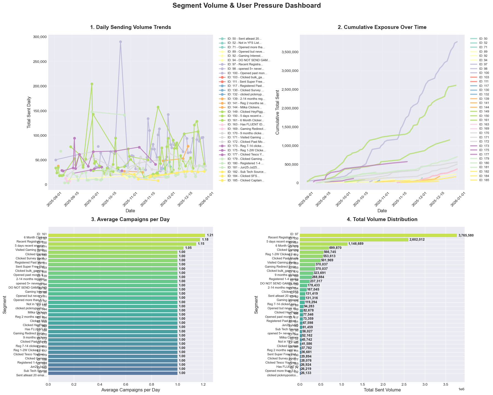
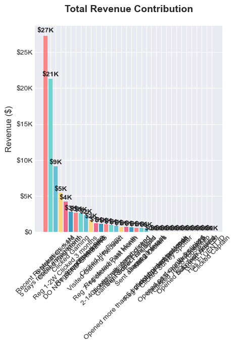

# Volume Sent per Segment & User Pressure

## Daily emails sent per segment

## Monthly emails sent per segment

## Estimate emails per user in each segment

## Identify segments that are potentially over-emailed

## Identify segments carrying high monetization load

## Insight

#### VOLUME & USER PRESSURE INSIGHTS

📊 VOLUME ANALYSIS:
- Total Daily Volume Analyzed: 13,018,100
- Total Campaigns: 330
- Average Daily Volume: 42,130
- Highest Volume Segment: ID 97 - 3,765,580 total sends
- Highest Frequency Segment: ID 161 - 1.21 campaigns/day

💰 MONETIZATION LOAD ANALYSIS:
- Top Segment Load: 28.9% of total volume
- Top 3 Segments Load: 57.7% of total volume
- Load Distribution: Balanced Distribution

⏱️  FREQUENCY ANALYSIS:
- ID 50: 1.00 campaigns/day, 30.2 days between sends
- ID 52: 1.00 campaigns/day, 121.0 days between sends
- ID 71: 1.00 campaigns/day, 121.0 days between sends
- ID 89: 1.00 campaigns/day, 30.2 days between sends
- ID 92: 1.00 campaigns/day, 15.1 days between sends
- ID 94: 1.00 campaigns/day, 11.0 days between sends
- ID 97: 1.18 campaigns/day, 2.4 days between sends

#### 📊 EMAIL VOLUME & USER PRESSURE INSIGHTS

🎯 KEY FINDINGS FOR 10 SEGMENTS:

1. VOLUME LEADERS:
- "Recent Registration + 1M" leads with 647K emails (35.9% of total)
- Total monthly volume across all segments: 1804K emails
- Volume range: 75K to 647K

2. FREQUENCY ANALYSIS:
- Highest campaign frequency: "Recent Registration + 1M" (8 campaigns)
- Average campaigns per segment: 3.9
- Days utilization: 12.3% of available days

3. INTENSITY METRICS:
- Highest daily volume: "6 Month Clickers" (108K emails/day)
- Average emails per campaign: 45.6K
- Estimated weekly volume per segment: 338.0K average

4. PRESSURE ASSESSMENT:
- Highest pressure segment: "Recent Registration + 1M" (Index: 92.5%)
- Pressure levels: {'NO DATA': 10}
- Average pressure index: 39.2%
...
- Develop segment-specific frequency rules based on pressure indices
- Create A/B testing framework for send time optimization
- Establish alerts for segments approaching critical pressure thresholds

