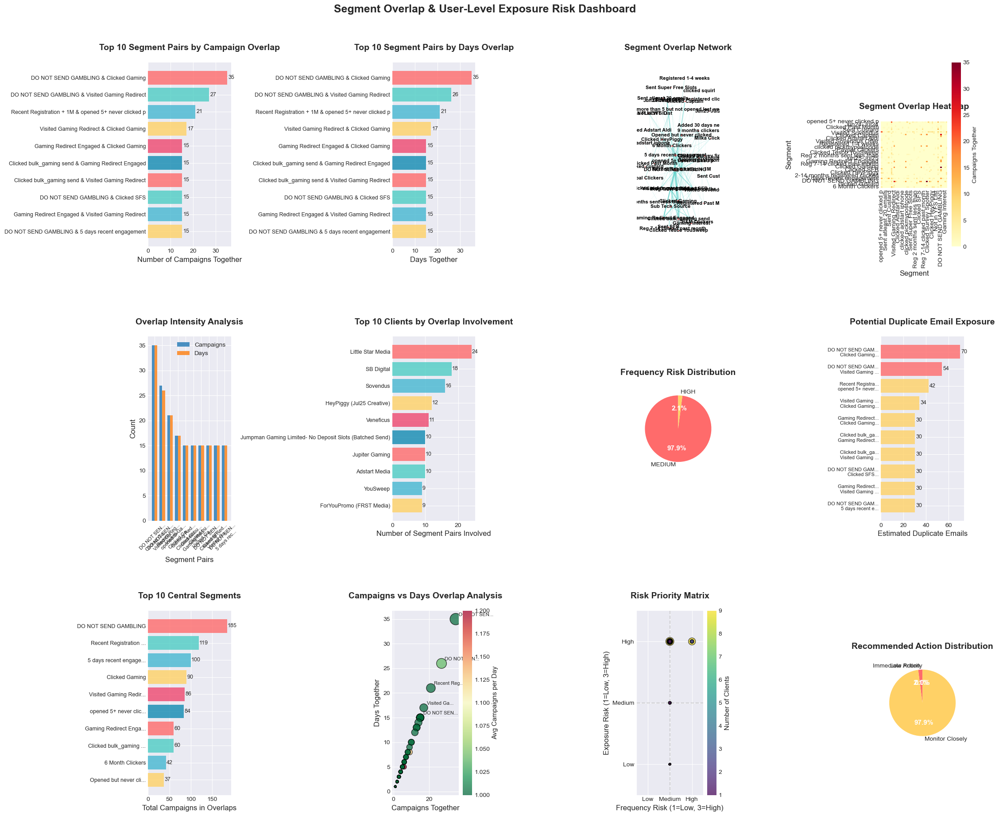
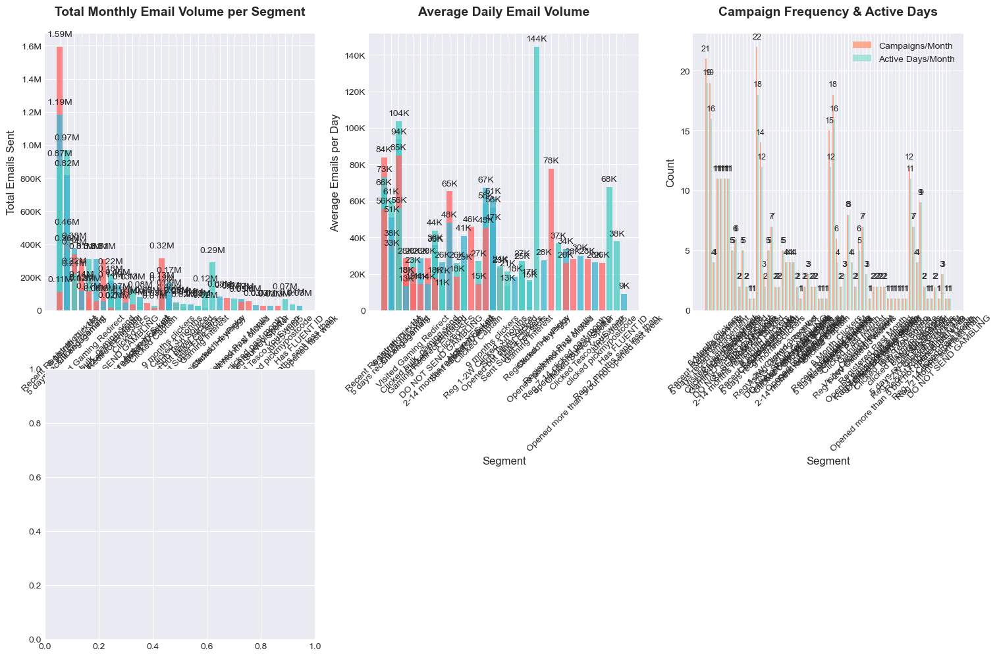
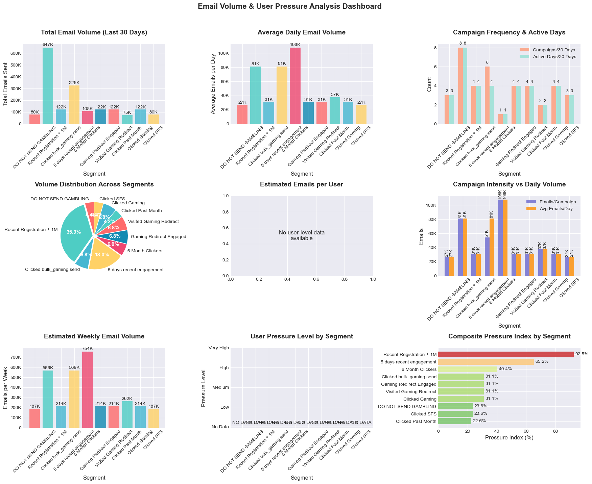
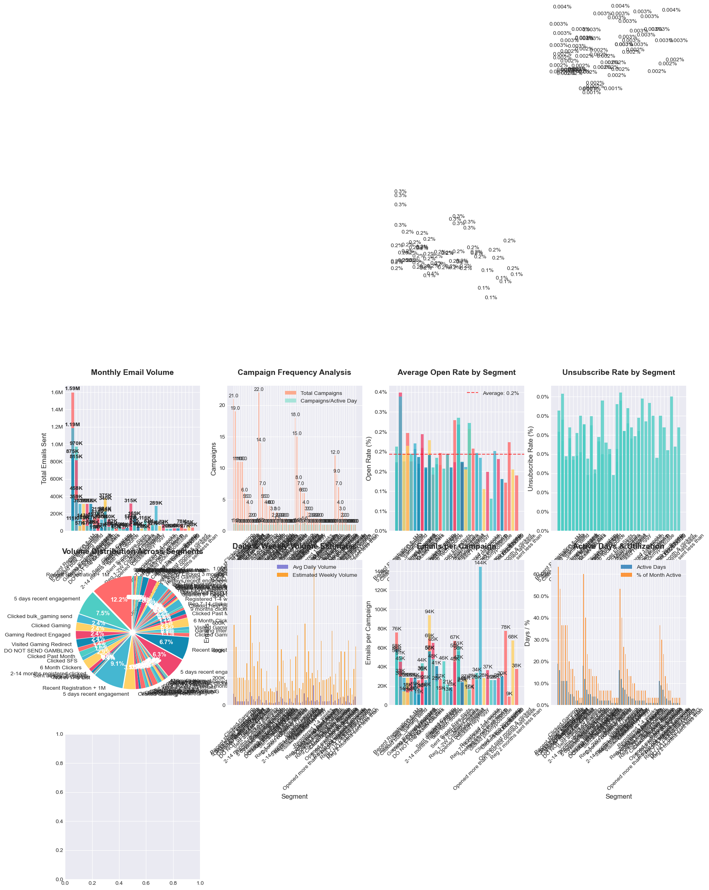

# Segment Overlap & User-Level Exposure

## Find which segments are used together in the same campaigns

## Find segments used by multiple clients on the same day

## Assess which users might be receiving multiple emails daily

## Simple analysis of segment overlap and exposure

## Insights

#### BUSINESS INSIGHTS & STRATEGIC RECOMMENDATIONS

#### 📊 SEGMENT OVERLAP & USER-LEVEL EXPOSURE ANALYSIS

🎯 KEY FINDINGS:

1. OVERLAP INTENSITY:
- Highest overlap pair: "DO NOT SEND GAMBLING" & "Clicked Gaming" 
    (35 campaigns together)
-  Most days together: "DO NOT SEND GAMBLING" & "Clicked Gaming" 
    (35 days)
-  Average campaigns together per pair: 4.4
-  Average days together per pair: 4.4

2. FREQUENCY RISKS:
-  High-risk pairs: 3 (>1.0 campaigns/day)
-  Medium-risk pairs: 143 (0.5-1 campaigns/day)
-  Average campaigns per day: 1.00
-  Highest frequency: "DO NOT SEND GAMBLING" & "Clicked Gaming" 
        (1.00 campaigns/day)
    
...
1. User-level daily email count tracking
2. Segment overlap alert system
3. Client-specific overlap reporting
4. Deliverability impact monitoring

#### BUSINESS INSIGHTS & STRATEGIC RECOMMENDATIONS

📊 CLIENT-SEGMENT USAGE PATTERNS ANALYSIS

🎯 KEY FINDINGS:

1. OVERALL ACTIVITY:
-  Total days analyzed: 27
-  Total unique segments: 7
-  Total unique clients: 28
-  Average clients per day: 2.7
-  Average campaigns per day: 2.7
-  Average segments active per day: 1.3

2. SEGMENT PERFORMANCE:
-  Most popular segment: "DO NOT SEND GAMBLING"
    - Used by 26 total unique clients
    - Generated 26 total campaigns
    - Average 2.2 clients per day

#### BUSINESS INSIGHTS & STRATEGIC RECOMMENDATIONS

📊 CAMPAIGN OVERLAP & SAME-DAY SEND EXCLUSION ANALYSIS
    
🎯 KEY FINDINGS:

1. CAMPAIGN VOLUME:
-  Total segments analyzed: 47
-  Highest volume segment: "DO NOT SEND GAMBLING" (106 campaigns)
-  Average campaigns per segment: 15.1
-  Range: 1 to 106 campaigns

2. CAMPAIGN INTENSITY:
-  Most intense segment: "6 Month Clickers" (1.21 campaigns/day)
-  Average campaigns per day: 1.02
-  Maximum daily campaigns: 3 (segment: Recent Registration + 1M)

3. OVERLAP ANALYSIS:
-  Highest overlap segment: "6 Month Clickers" (21.4% days with overlap)
-  Average overlap percentage: 1.9%
-  Total days with overlap across segments: 36
...

Exclusions Needed by Type:
  -  None: 42 segments
  -  Same-day exclusion: 5 segments