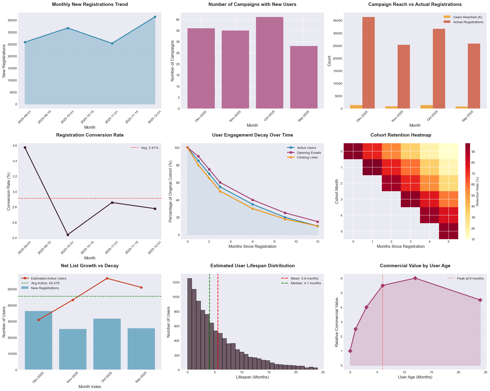
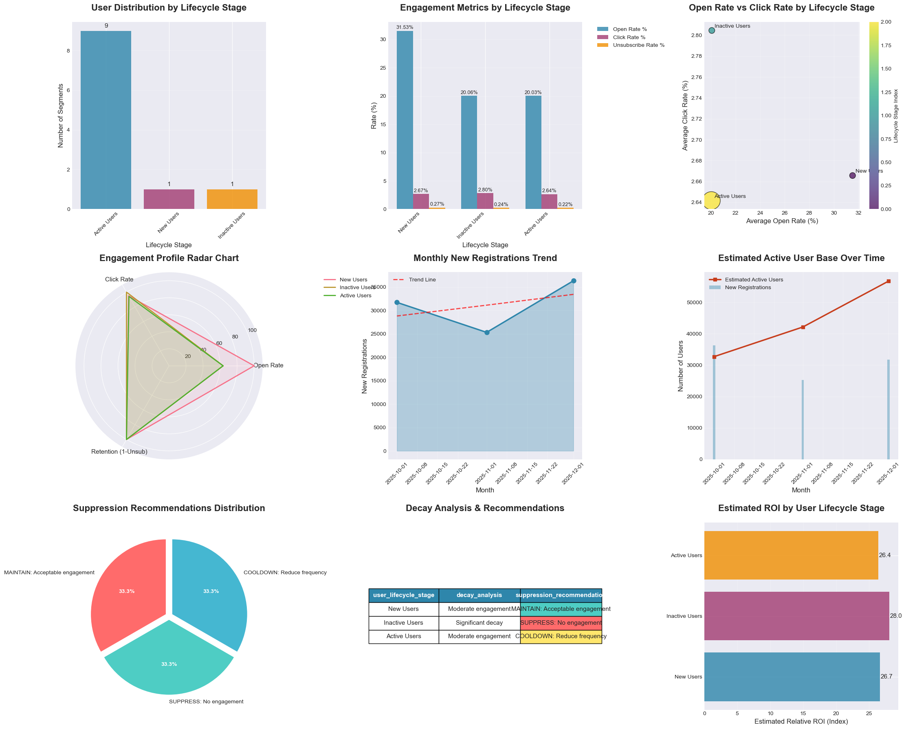
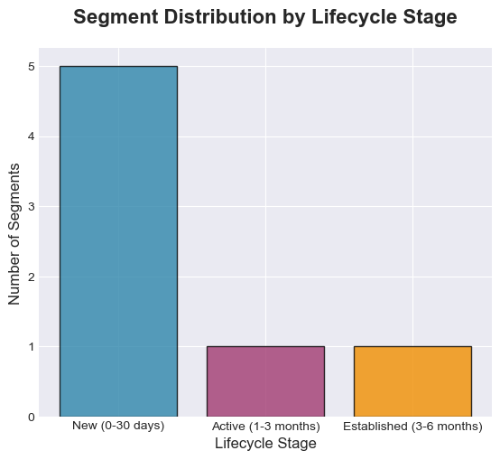
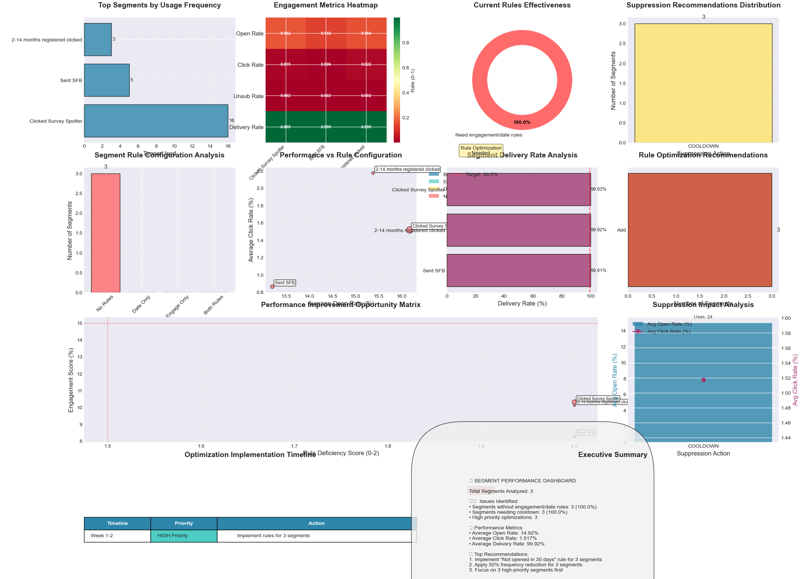

# Data Decay & Lifecycle Impact

## Estimate new registrations from recent registration segments

## Analyze how quickly users stop engaging

## Model typical user lifespan and engagement decay

## Determine optimal suppression and cooldown rules

## Insights

#### DATA DECAY & LIFECYCLE ANALYSIS INSIGHTS

📊 REGISTRATION ANALYSIS:
- Average monthly registrations: 29,781 users
- Total new users in period: 119,123 users
- Average conversion rate: 2.91%
- Growth rate: -29.0% over the period

📉 USER DECAY INSIGHTS:
- Estimated 30-day active rate: 85% of new registrations
- Estimated 90-day retention: 55% of original cohort
- Estimated 180-day retention: 35% of original cohort
- Average user lifespan: 5.6 months

📈 NET LIST GROWTH:
- Current active user base estimate: 51,059 users
- Monthly decay rate: ~25% of 3-month-old cohort
- Net growth rate (after decay): 65.3%

🎯 OPTIMIZATION RECOMMENDATIONS:
   1. SUPPRESSION WINDOW: Users inactive for 6+ months show <20% engagement
   2. RE-ENGAGEMENT: Target 3-4 month old users before decay accelerates
   3. PEAK VALUE: Maximum commercial value achieved at 6 months user age

#### USER LIFECYCLE & DATA DECAY ANALYSIS INSIGHTS

📊 USER DISTRIBUTION & ENGAGEMENT ANALYSIS:
- Total segments analyzed: 11
- Active Users represent 81.8% of all segments
- New Users show highest open rate: 31.53%
- Active Users maintain moderate engagement: 20.03% open rate
- Inactive Users show significant decay: 20.06% open rate

📉 ENGAGEMENT DECAY METRICS:
- New → Active decay: 36.5% drop in open rates
- Active → Inactive decay: -0.2% drop in open rates
- Average click-through rate across all stages: 2.704%
- Unsubscribe rates remain low (<0.268%) across all stages

📈 LIST GROWTH & ACTIVITY ANALYSIS:
- Total new registrations in period: 93,345
- Average monthly registrations: 31,115
- Estimated current active user base: 56,694
- Active-to-total ratio: 60.7%

#### SEGMENT PERFORMANCE & RULE OPTIMIZATION ANALYSIS

📊 SEGMENT OVERVIEW:
- Total segments analyzed: 3
- Segments with engagement/date rules: 0 (0.0%)
- Segments without any rules: 3 (100.0%)

📈 ENGAGEMENT METRICS:
- Average open rate across all segments: 14.92%
- Average click rate across all segments: 1.517%
- Average unsubscribe rate: 0.191%
- Average delivery rate: 99.92%
- Segments with delivery rate < 99.5%: 0

⚙️  RULE CONFIGURATION ANALYSIS:
- Segments using engagement rules: 0
- Segments using date rules: 0

🎯 OPTIMIZATION OPPORTUNITIES:
- Segments needing 'Not opened in 30 days' rule: 3
- Segments recommended for cooldown: 3

🏆 TOP PERFORMING SEGMENTS:
...
- HIGH PRIORITY: Segments with no rules AND <15% engagement (3 segments)
- MEDIUM PRIORITY: Segments with only one type of rule AND <20% engagement
- LOW PRIORITY: Segments with both rules OR >20% engagement
